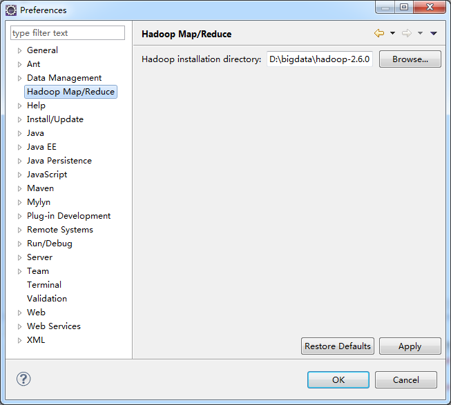
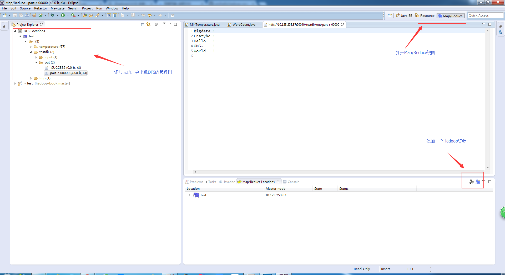
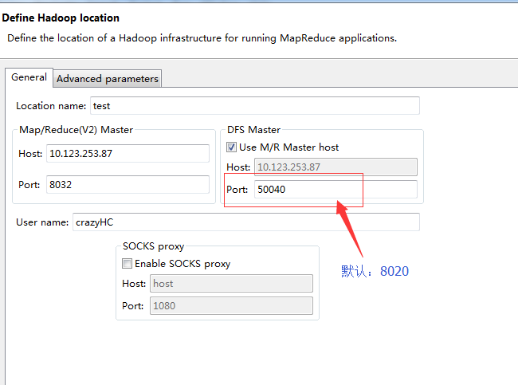

> Hadoop是一个由Apache基金会所开发的分布式系统基础架构。Hadoop的框架最核心的设计就是：HDFS和MapReduce。HDFS为海量的数据提供了存储，则MapReduce为海量的数据提供了计算。

{:toc .toc}

## Hadoop安装 

1、  先安装JDK及JRE

    yum install -y java java-1.8.0-openjdk-devel

2、 下载hadoop并安装

下载地址： http://hadoop.apache.org/releases.html  
配置环境变量： 
   
    [root@hadoop_0 ~]# vim /etc/profile
    # 添加环境变量
    export JAVA_HOME=/usr/lib/jvm/java
    HADOOP_HOME=/opt/hadoop-2.8.1
    export PATH=$PATH:$HADOOP_HOME/bin:$HADOOP_HOME/sbin

3、 Hadoop独立模式

没有守护程序，无须额外配置，只适合在开发环境中使用。

4、 Hadoop伪分布模式

模拟分布式环境。同样用于开发测试。配置如下：

    [root@hadoop_0 hadoop_pseudo]# pwd
	/opt/hadoop-2.8.1/etc/hadoop_pseudo

	# 配置core-site.xml,hdfs-site.xml,mapred-site.xml,yarn-site.xml四个文件。

	[root@hadoop_0 hadoop_pseudo]# cat core-site.xml 
    <configuration>
    	<property>
    		<name>fs.defaultFS</name>
    		<value>hdfs://localhost/</value>
    	</property>
    </configuration>
	[root@hadoop_0 hadoop_pseudo]# cat hdfs-site.xml 
	<configuration>
		<property>
			<name>dfs.replication</name>
			<value>1</value>
		</property>
	</configuration>
	[root@hadoop_0 hadoop_pseudo]# cat mapred-site.xml 
	<configuration>
        <property>
                <name>mapreduce.framework.name</name>
                <value>yarn</value>
        </property>
	</configuration>	
	[root@hadoop_0 hadoop_pseudo]# cat yarn-site.xml 
	<configuration>
        <property>
                <name>yarn.resourcemanager.hostname</name>
                <value>localhost</value>
        </property>
        <property>
                <name>yarn.nodemanager.aux-services</name>
                <value>mapreduce_shuffle</value>
        </property>
		<property>
                <name>yarn.resourcemanager.webapp.address</name>
                <value>10.123.253.87:8088</value>
        </property>
	</configuration>

	# 本地设置ssh免登陆。

	[root@hadoop_0 hadoop_pseudo]# ssh-keygen 
	[root@hadoop_0 hadoop_pseudo]# ssh-copy-id localhost

	# 格式化文件系统
	[root@hadoop_0 hadoop_pseudo]# hadoop namenode -format

	# 修改hadoop环境变量
	[root@hadoop_0 hadoop_pseudo]# cat hadoop-env.sh 
	# export JAVA_HOME=${JAVA_HOME}
	export JAVA_HOME=/usr/lib/jvm/java
	
	# 配置hadoop文件路径。默认$HADOOP_INSTALL/ect/hadoop下
	[root@hadoop_0 hadoop_pseudo]# export HADOOP_CONF_DIR=$HADOOP_INSTALL/etc/hadoop_pseudo 

	# 启动hadoop
	[root@hadoop_0 hadoop_pseudo]# start-dfs.sh   # --config $HADOOP_INSTALL/etc/hadoop_pseudo 
	[root@hadoop_0 hadoop_pseudo]# start-yarn.sh  # --config $HADOOP_INSTALL/etc/hadoop_pseudo 
	
	# 查看进程
	[root@hadoop_0 hadoop_pseudo]# jps -l
	4288 sun.tools.jps.Jps
	3874 org.apache.hadoop.yarn.server.resourcemanager.ResourceManager
	3971 org.apache.hadoop.yarn.server.nodemanager.NodeManager
	3720 org.apache.hadoop.hdfs.server.namenode.SecondaryNameNode
	3449 org.apache.hadoop.hdfs.server.namenode.NameNode
	3534 org.apache.hadoop.hdfs.server.datanode.DataNode

	# 试着建个目录
	[root@hadoop_0 hadoop_pseudo]# hadoop fs -mkdir -p  /crazyhc/test
	[root@hadoop_0 hadoop_pseudo]# hadoop fs -ls /
	Found 1 items
	drwxr-xr-x   - root supergroup          0 2017-09-05 12:01 /crazyhc

	# 停止hadoop
	[root@hadoop_0 hadoop_pseudo]# stop-yarn.sh # --config $HADOOP_INSTALL/etc/hadoop_pseudo
	[root@hadoop_0 hadoop_pseudo]# stop-dfs.sh  # --config $HADOOP_INSTALL/etc/hadoop_pseudo

最后可以查看一下web界面。  名称节点：http://10.123.253.87:50070 资源管理器：http://10.123.253.87:8088

5、 Hadoop完全分布式

主要用于生产环境。配置雷同伪分布式。不做过多讲解。

## HADOOP常用命令

Hadoop的命令基本跟shell命令一直。具体参考下官网：http://hadoop.apache.org/docs/stable/hadoop-project-dist/hadoop-common/FileSystemShell.html

## Windows开发环境配置

1、 安装Hadoop

解压安装包，配置环境变量。同Linux安装。这里建议使用hadoop2.6.5，服务器环境也要使用相同版本。  
windows下环境变量，如何避免空格问题。如：D:\Program Files = D:\Progra~2  

**重点：**  

windows下需要添加文件，如下面的设置。  
下载 https://github.com/amihalik/hadoop-common-2.6.0-bin  
拷贝bin目录下的文件到%HADOOP_HOME%/bin下。  
拷贝hadoop.dll文件到System32目录下。

2、 安装Eclipse开发插件  

这里推荐使用/hadoop2x-eclipse-plugin，按版本需要自己进行编译。eclipse版本为kepler。插件下载地址： https://github.com/winghc/hadoop2x-eclipse-plugin  
然后，  

在Windoow/Preferences/Hadoop Map/Reduce下配置本地hadoop的家目录。如下图：

添加一个hadoop资源，如下图：  

定义一个hadoop资源，不要用原来的端口。如下图：  

